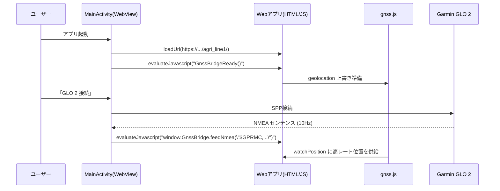

# android-webview-glo2 ファイル構成と役割（スライド）

## 1. 全体像

```mermaid
graph TD
  A[MainActivity.kt] -->|loadUrl| B[GitHub Pages (Webアプリ)]
  A -->|GnssBridgeReady() 注入| C[gnss.js (JSブリッジ)]
  A -->|SPP接続\nNMEA読取| D[Garmin GLO 2]
  C -->|feedNmea / feedFix| B
```

- **目的**: WebViewでWebアプリを表示し、GLO 2からのGNSSを10HzでJSへ供給

---

## 2. 主要ファイルの役割

### app/src/main/java/com/example/glo2/MainActivity.kt
- WebViewを初期化、Pages URLを `loadUrl("https://tomiyasu0428.github.io/agri_line1/")`
- ページ描画後に `GnssBridgeReady()` を `evaluateJavascript` で注入
- 右下ボタンから Bluetooth SPP 接続を開始し、`NMEA` を `feedNmea` へ流す

### app/src/main/AndroidManifest.xml
- 権限宣言: `INTERNET`, `ACCESS_FINE_LOCATION`, `BLUETOOTH_*`
- ランチャーアクティビティの定義

### app/src/main/res/layout/activity_main.xml
- `WebView` 埋め込み
- 右下に `GLO 2 接続` ボタン配置

### app/build.gradle.kts / settings.gradle.kts
- アプリのビルド設定、依存関係、Kotlin/SDKバージョン

### proguard-rules.pro
- リリースビルド用の縮小/難読化の調整（現状空）

### README.md
- ビルド手順、権限、使い方（接続手順）の説明

---

## 3. データフロー（詳細）



---

## 4. よくある質問（FAQ）
- Q: PWAでも動作する？
  - A: はい。WebアプリはPagesで配信。Android側はWebViewで同URLを表示します。
- Q: iOS対応は？
  - A: iOSはNMEA直接読取不可。`gnss.js` が無い場合はブラウザ標準の geolocation を使用。
- Q: `feedFix` と `feedNmea` の違い？
  - A: `feedFix` はネイティブでパース済みデータを直接渡す方法。簡単で低レイテンシ。
